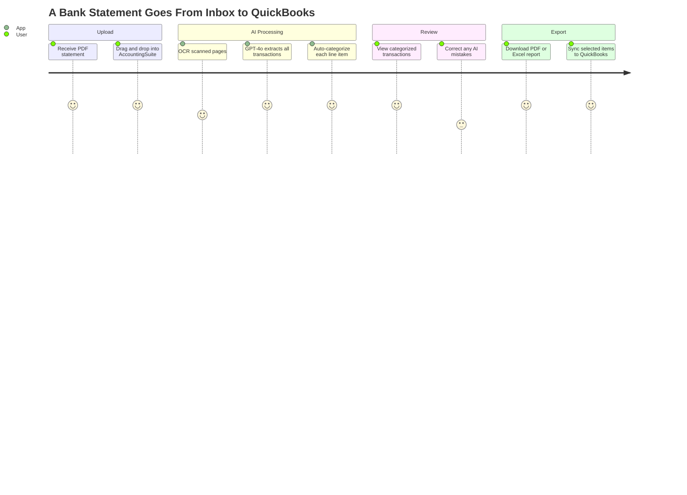
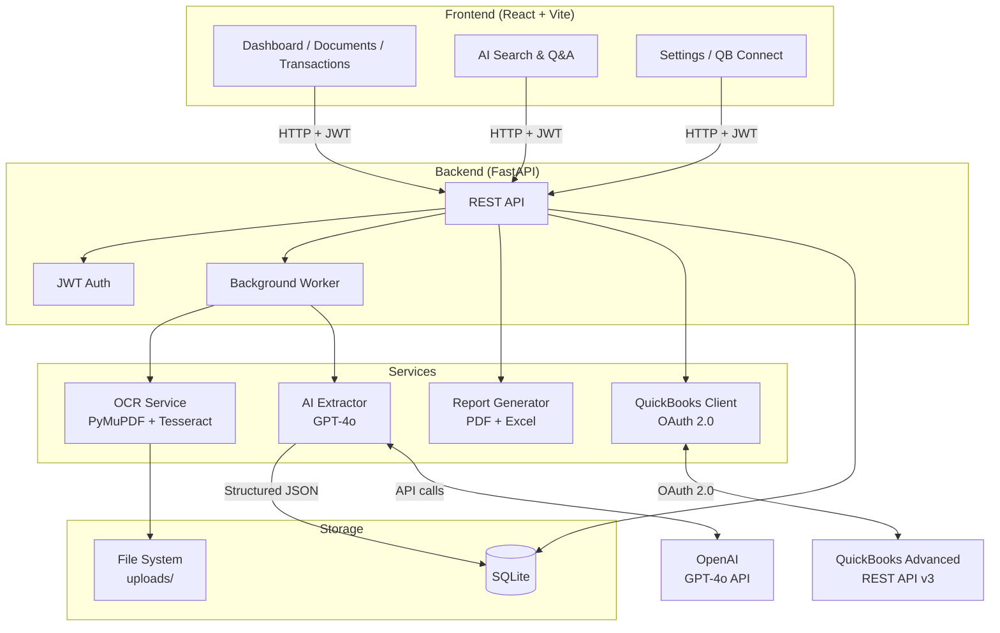
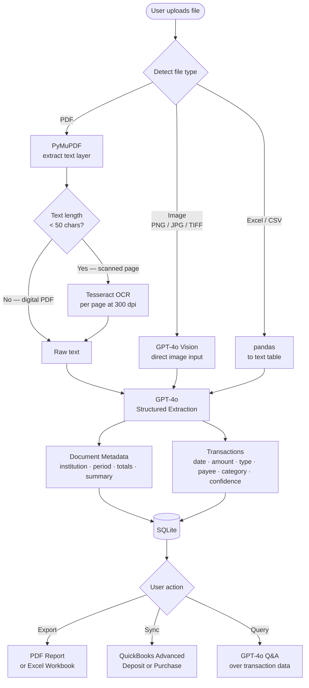
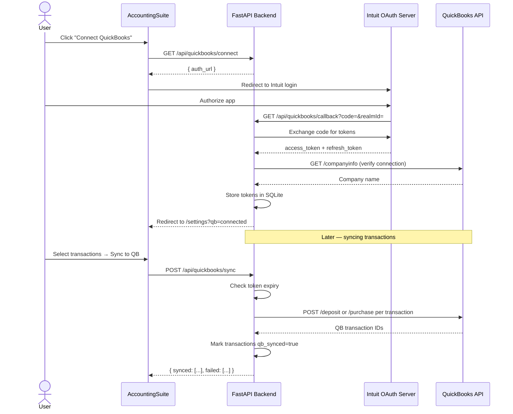
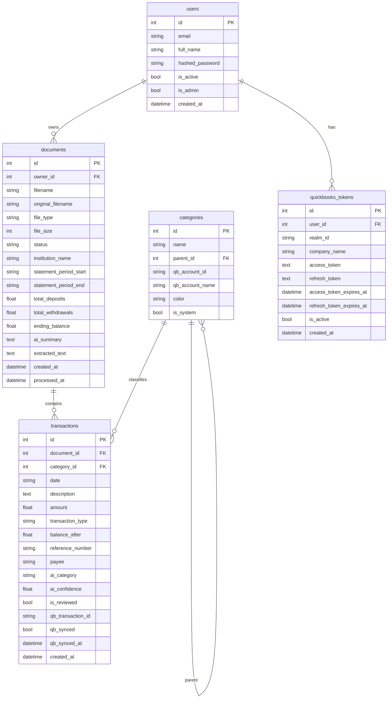

# AccountingSuite


AI-powered financial document extraction and analysis platform with QuickBooks Advanced integration.

Upload bank statements, PDFs, scanned documents, and Excel files — the platform extracts transactions automatically using GPT-4o, categorizes them, and syncs them directly to QuickBooks.

---

## What Does This App Do?

AccountingSuite solves a common problem for small businesses and accountants: bank statements arrive in all kinds of formats — PDFs, scanned paper, Excel exports — and someone has to manually read them, categorize every transaction, and key it all into QuickBooks. This app eliminates that entirely.

### 1. Upload Financial Documents
Drop in any of these file types:
- **Bank statements** (PDF, scanned images)
- **Excel / CSV** spreadsheets
- **Scanned documents** (photos of paper statements)

### 2. AI Extracts Everything Automatically
GPT-4o reads the document and pulls out:
- Institution name, statement period, and account totals
- Every transaction — date, amount, payee, description, running balance
- A plain-English summary of the statement

For scanned or photographed documents, Tesseract OCR converts the image to text first before passing it to the AI.

### 3. Auto-Categorizes Transactions
Each transaction gets an AI-assigned category with a confidence score:

> *"Shell Fleet charge on March 7 → **fuel** (94% confident)"*

18 built-in categories: payroll, rent, utilities, fuel, insurance, taxes, vendor payments, office supplies, travel, entertainment, and more. Categories map directly to your QuickBooks chart of accounts.

### 4. Syncs to QuickBooks Advanced
Connect your QuickBooks company once via OAuth. Then select any transactions and push them directly into QuickBooks as:
- **Bank Deposits** for income and revenue
- **Purchases / Expenses** for withdrawals and payments

No re-keying. No copy-paste. Synced transactions are flagged so you never duplicate them.

### 5. AI Search & Q&A
Ask natural language questions about your financial data:

> *"What were my top 5 expenses last month?"*
> *"How much did I spend on utilities this quarter?"*
> *"List all bank fees charged in 2026"*

GPT-4o analyzes your full transaction history and answers in plain English.

### 6. Export Clean Reports
Download any processed statement as:
- **PDF report** — formatted with a summary header, AI narrative, and full transaction table
- **Excel workbook** — two sheets (Summary + Transactions), with filters and freeze panes, ready to send to your accountant

### Who It's For
Small business owners or accountants who receive bank statements in multiple formats and need to organize, categorize, and sync that data into QuickBooks — without manually entering every transaction.



---

## Features

- **Document Ingestion** — PDF, Excel (xlsx/xls), CSV, and scanned images (PNG, JPG, TIFF)
- **AI Extraction** — GPT-4o extracts transactions, identifies payees, dates, amounts, and running balances
- **OCR Support** — Tesseract OCR handles scanned/photographed bank statements
- **Auto-Categorization** — 20+ categories (payroll, rent, utilities, fuel, insurance, taxes, etc.) with confidence scores
- **QuickBooks Sync** — OAuth 2.0 connection to QuickBooks Advanced; push deposits and expenses with one click
- **Report Export** — Download clean PDF and Excel reports per document
- **AI Search & Q&A** — Keyword search across all transactions; ask GPT-4o natural language questions about your data
- **Multi-user Auth** — JWT-based login with per-user document isolation

---

## Architecture



---

## Tech Stack

| Layer | Technology |
|---|---|
| Backend | Python 3.12, FastAPI, SQLAlchemy (async) |
| Database | SQLite (via aiosqlite) |
| AI Model | OpenAI GPT-4o (vision + JSON structured output) |
| OCR | PyMuPDF + Tesseract |
| Spreadsheets | pandas, openpyxl |
| QuickBooks | Intuit OAuth 2.0, QB REST API v3 |
| Reports | reportlab (PDF), xlsxwriter (Excel) |
| Frontend | React 18, Vite, Tailwind CSS, TanStack Query |
| Auth | JWT (python-jose), bcrypt (passlib) |
| Deployment | Docker + Docker Compose |

---

## Project Structure

```
AccountingSuite/
├── backend/
│   ├── main.py                     # FastAPI application entry point
│   ├── config.py                   # Environment-based settings
│   ├── database.py                 # SQLite async engine + session
│   ├── requirements.txt
│   ├── Dockerfile
│   ├── .env.example                # Copy to .env and fill in keys
│   ├── models/
│   │   ├── user.py                 # User accounts
│   │   ├── document.py             # Uploaded documents + AI metadata
│   │   ├── transaction.py          # Extracted transactions
│   │   ├── category.py             # Transaction categories
│   │   └── quickbooks_token.py     # QB OAuth tokens
│   ├── routers/
│   │   ├── auth.py                 # Register, login, /me
│   │   ├── documents.py            # Upload, list, delete, background processing
│   │   ├── transactions.py         # List, filter, patch, stats
│   │   ├── quickbooks.py           # OAuth connect/callback, sync
│   │   ├── reports.py              # PDF and Excel export
│   │   └── search.py               # Keyword search + GPT-4o Q&A
│   ├── services/
│   │   ├── ocr.py                  # PDF text extraction + Tesseract OCR
│   │   ├── ai_extractor.py         # GPT-4o extraction prompts
│   │   ├── quickbooks.py           # QB API client (deposits, expenses, accounts)
│   │   └── report_generator.py     # PDF + Excel report builders
│   └── utils/
│       └── security.py             # JWT helpers, password hashing, auth dependency
├── frontend/
│   ├── src/
│   │   ├── App.jsx                 # Routes + private route guard
│   │   ├── api/client.js           # Axios client + all API calls
│   │   ├── components/
│   │   │   ├── Layout.jsx
│   │   │   └── Sidebar.jsx
│   │   └── pages/
│   │       ├── Login.jsx           # Sign in / register
│   │       ├── Dashboard.jsx       # Stats cards + category chart
│   │       ├── Documents.jsx       # Drag-and-drop upload + document table
│   │       ├── Transactions.jsx    # Transaction table + QB sync
│   │       ├── Reports.jsx         # PDF/Excel export per document
│   │       ├── Search.jsx          # Keyword search + AI Q&A
│   │       └── Settings.jsx        # QB OAuth connect + account info
│   ├── package.json
│   ├── vite.config.js
│   ├── tailwind.config.js
│   └── Dockerfile
├── docker-compose.yml
└── setup.ps1                       # Windows one-step setup script
```

---

## Prerequisites

| Requirement | Version | Notes |
|---|---|---|
| Python | 3.11+ | [python.org](https://python.org) |
| Node.js | 18+ | [nodejs.org](https://nodejs.org) |
| Tesseract OCR | 5+ | See below |
| OpenAI API key | — | [platform.openai.com](https://platform.openai.com) |
| QuickBooks app | Advanced | [developer.intuit.com](https://developer.intuit.com) |

### Installing Tesseract on Windows

Download and run the installer from [UB Mannheim](https://github.com/UB-Mannheim/tesseract/wiki).
Default install path: `C:\Program Files\Tesseract-OCR\tesseract.exe`

Set in `backend/.env`:
```
TESSERACT_CMD=C:\Program Files\Tesseract-OCR\tesseract.exe
```

---

## Setup

### Option A — Automated (Windows)

```powershell
cd "C:\Data Engineering\AccountingSuite"
.\setup.ps1
```

The script creates a Python virtual environment, installs all dependencies, and copies the `.env` template.

### Option B — Manual

**Backend**
```powershell
cd backend
python -m venv .venv
.\.venv\Scripts\Activate.ps1
pip install -r requirements.txt
Copy-Item .env.example .env
```

**Frontend**
```powershell
cd frontend
npm install
```

---

## Configuration

Edit `backend/.env`:

```env
# Required
APP_SECRET_KEY=your-random-32-char-secret-key
OPENAI_API_KEY=sk-...

# QuickBooks (from developer.intuit.com)
QB_CLIENT_ID=your_client_id
QB_CLIENT_SECRET=your_client_secret
QB_ENVIRONMENT=sandbox        # change to: production

# Optional overrides
OPENAI_MODEL=gpt-4o
MAX_UPLOAD_MB=50
TESSERACT_CMD=tesseract       # full path on Windows if not in PATH
```

### QuickBooks App Setup

1. Go to [developer.intuit.com](https://developer.intuit.com) and sign in
2. Create a new app → select **QuickBooks Online and Payments**
3. Under **Keys & OAuth**, copy **Client ID** and **Client Secret**
4. Add this redirect URI:
   ```
   http://localhost:8000/api/quickbooks/callback
   ```
5. Paste the keys into `backend/.env`
6. Use `QB_ENVIRONMENT=sandbox` for testing, `production` for live data

---

## Running Locally

**Terminal 1 — Backend**
```powershell
cd backend
.\.venv\Scripts\Activate.ps1
uvicorn main:app --reload
```

API available at `http://localhost:8000`
Interactive docs at `http://localhost:8000/docs`

**Terminal 2 — Frontend**
```powershell
cd frontend
npm run dev
```

App available at `http://localhost:5173`

---

## Running with Docker

```bash
# Copy and edit env file first
cp backend/.env.example backend/.env
# (edit backend/.env with your keys)

docker compose up --build
```

- Frontend: `http://localhost:5173`
- Backend API: `http://localhost:8000`

---

## API Reference

### Authentication

| Method | Endpoint | Description |
|---|---|---|
| POST | `/api/auth/register` | Create account |
| POST | `/api/auth/login` | Login (returns JWT) |
| GET | `/api/auth/me` | Current user |

### Documents

| Method | Endpoint | Description |
|---|---|---|
| POST | `/api/documents/upload` | Upload a file (triggers AI extraction) |
| GET | `/api/documents/` | List all documents |
| GET | `/api/documents/{id}` | Get document details |
| DELETE | `/api/documents/{id}` | Delete document + transactions |

### Transactions

| Method | Endpoint | Description |
|---|---|---|
| GET | `/api/transactions/` | List transactions (filterable) |
| GET | `/api/transactions/stats` | Totals by type and category |
| PATCH | `/api/transactions/{id}` | Update category, review status, memo |

### QuickBooks

| Method | Endpoint | Description |
|---|---|---|
| GET | `/api/quickbooks/connect` | Get OAuth authorization URL |
| GET | `/api/quickbooks/callback` | OAuth callback (Intuit redirects here) |
| GET | `/api/quickbooks/status` | Connection status |
| GET | `/api/quickbooks/accounts` | List QB chart of accounts |
| POST | `/api/quickbooks/sync` | Sync selected transactions to QB |
| DELETE | `/api/quickbooks/disconnect` | Revoke connection |

### Reports

| Method | Endpoint | Description |
|---|---|---|
| GET | `/api/reports/{doc_id}/pdf` | Download PDF report |
| GET | `/api/reports/{doc_id}/excel` | Download Excel workbook |

### Search

| Method | Endpoint | Description |
|---|---|---|
| GET | `/api/search/transactions?q=` | Keyword search |
| POST | `/api/search/ask?question=` | GPT-4o natural language Q&A |

---

## How Document Processing Works



---

## QuickBooks OAuth Flow



---

## Database Schema



---

## Supported Transaction Categories

| Category | Category |
|---|---|
| payroll | rent |
| utilities | groceries |
| fuel | insurance |
| taxes | loan_payment |
| transfer | bank_fee |
| interest_income | sales_revenue |
| vendor_payment | office_supplies |
| travel | entertainment |
| medical | other |

---

## Supported File Types

| Format | Extension | Method |
|---|---|---|
| PDF (text) | `.pdf` | PyMuPDF text layer |
| PDF (scanned) | `.pdf` | Tesseract OCR per page |
| Excel | `.xlsx`, `.xls` | openpyxl + pandas |
| CSV | `.csv` | pandas |
| Image | `.png`, `.jpg`, `.jpeg`, `.tiff`, `.bmp` | GPT-4o Vision |

---

## Security Notes

- All uploaded files are stored under `backend/uploads/{user_id}/` — users cannot access each other's files
- Passwords are hashed with bcrypt
- JWTs expire after 8 hours (configurable via `JWT_EXPIRE_MINUTES`)
- QuickBooks tokens are refreshed automatically before expiry
- Only the last 4 digits of account numbers are stored
- The `.env` file is excluded from version control — never commit it

---

## Roadmap

- [ ] Multi-company QuickBooks support
- [ ] Recurring transaction detection
- [ ] Vendor auto-matching against QB vendor list
- [ ] Email ingestion (forward statements to a mailbox)
- [ ] Scheduled automatic QB sync
- [ ] Audit log / change history
- [ ] Role-based access (accountant vs. owner view)
- [ ] PostgreSQL migration for multi-user production deployments
